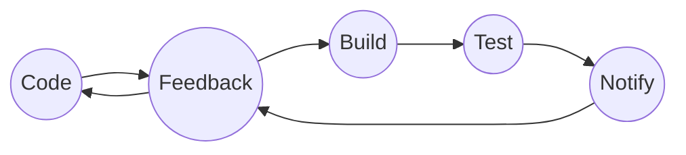

# Devops-udemy

This repository contains learning from an udemy course on Devops and the projects completed throught it.

## Software Development Process

### Software Development LifeCycle

1. Requirement - Gathering and Analysis
   - Product Features
   - Users
   - Usage
   - User Requirement
   - Market State
2. Planning - What do we want?
   - Cost
   - Resources
   - Risks
3. Design - Architects
   - Based on the detailed requirement system design documents are created.
4. Development - Developers
   - Develops the product with the inputs from the design document.
5. Testing - Quality Assurance
   - Identify the defects to ensure the quality of the products.
6. Deployment - System Admins
   - The product will be deployed to the production.
7. Maintenance - Changes & Uptime
   - System health, Performance, Uptime with regular changes.

---

### Models in SDLC

1. Waterfall
2. Agile
3. Spiral
4. Big Bang
   etc.

---

### Watefall Model

- Each phase must be complete before going to the next phase.
- Cannot accommodate changing requirements.
- No working software is produced until late in the cycle.

---

### Agile Model

- The whole process will be divided into tasks which will be completed within 2-4 weeks and repeated until all tasks finished.
- After each task completed the demo will be delivered and based on the feedback next set of tasks will continue.
- Cons- Regular code changes needs to be deployed on the servers so the testers can access and test. - Time consuming
- To resolve this issue we have Devops in which all the teams will communicate each other and integrate the changes.
- Basically devops means Dev(Developers) and Ops(Operations) are working together.

**DevOps Lifecycle**

- Code-> Developer commits the code.
- Code Build-> Deployable Software: Artifact
- Code Test -> Unit and Integration Test.
- Code Analysis -> Vulnerability and best practices.
- Delivery -> Deploy changes to staging.
- DB/Security changes -> Every other ops changes.
- Software Testing -> QA Functional, load, Performance tests.
- Deploy to production
- Go live - User traffic diverted to new changes
- User Approval - User feedback
- Keep Monitoring

---

### Continuous Integration

- Automated feature in Devops which generates software and it's features quickly and efficiently.
- We will use a version control such as github to store our code.
- While working in a team developers will pull and push codes continuously several times in a day.
- There will be multiple commits happening continuously.
- Then these changes will go to build server stage where it is built, tested and evaluated and a software artifact will be generated.
- This artifact or software will be stored in a repository.
- Artifact or software is an archive of files generated from the build process.
- Based on the programming language we use it is then packaged. It might be war or jar in Java. DLL/EXE/MSI in windows. ZIP or TAR.
- From repository it will be moved for further testing, once the artifacts are deployed testers can conduct the software testing and once they approve it can be shipped to production servers.

_Problem in this_

- If there are errors found in build server stage then developer needs to change codes in several places.
- It would be resolved if the error is found earlier.
  _Solution_
- After every commit the code will be built and tested.
- But since developers commits several times in a day it's humanly impossible to build and test for every commits.
- To resolve this we will use an automated process which will get the code committed build it, test it and send notifications if there were any failures.

- This automated process is called Continuous Integration/CI.
- The goal is to identify the errors early so that it won't multiply.
  **Tools**
- IDE
  - Eclipse
  - Visula studio
  - Atom
  - Pycharm
  - etc.
- Version Control System
  - GIT
  - SVN
  - TFS
  - PERFORCE
  - etc.
- Build Tools
  - Maven, Ant, Gradle
  - MSBuild, Visual Build
  - IBM Urban Code
  - MAKE
  - GRUNT
- Software Repository
  - Sonatype Nexus
  - JFROG Artifactory
  - ARCHIVA
  - Cloudsmith Package
  - GRUNT
- CI Tools
  - Jenkins
  - CIRCLECI
  - TEAMCITY
  - BAMBOO CI
  - CRUISE CONTROL

---

### Continuous Delivery

- It is a process for delivering the code changes to the servers quickly and efficiently.
- Deployment
  - Server Provisioning
  - Dependencies
  - Conf Changes
  - Network
  - Artifact Deploy
  - etc.
- Tools
  - Ansible, Puppet, Chef
  - Terraform, Cformation
  - Jenkins, Octopus Deploy
  - Helm Charts
  - Code Deploy
  - etc
- Test Automation - Functional, Performance, Load, DB, Security and any other test cases need to be automated.
- Automate everything and then stitch it together.
- Continuous Delivery is a software development practice where code changes are automatically prepared for a release to production.
