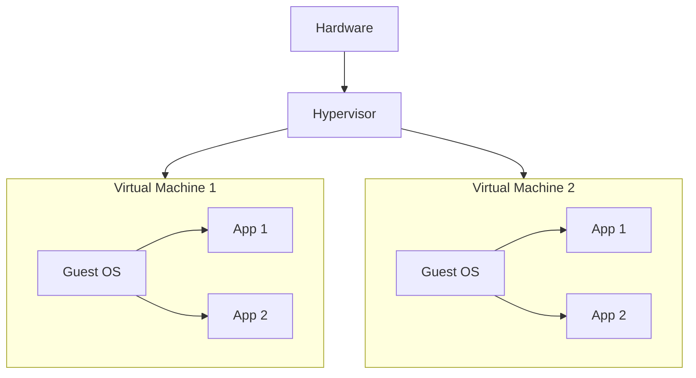

# Virtualization

- One computer can run multiple os.
- Instead of running multiple main services inside one computer we can run multiple os in one computer and run all our services on top of that.
- Virtualization partitions our physical resource into virtual resource.
- Server virtualization, Network Virtualization, Storage Virtualization

- Host OS - The operating system of the physical machine.
- Guest OS - The OS of virtual machine.
- Snapshot - It is a way of taking backup of a virtual machine.
- Hypervisor - The tool which helps us to create virtual machine.
- Types of hypervisor

1. Type 1

- Bare metal
- Runs as base OS
- Production
- Eg: VMWare esxi, Xen Hypervisor, Hyper V

2. Type 2
   - Runs as a software
   - Learn & Test
   - Oracle VMWare

---

## Creating VMs

- Method 1 - Manual
- Method 2 - Automated

centos iso file link: https://mirror.stream.centos.org/9-stream/BaseOS/x86_64/iso/

### Automated method - Vagrant

- While we install the vm manually we face problems in os installation, time consuming, human error etc.
- So we use vagrant to create vm automatically.
- There will not be any os installations - we will have vm images/box. Free boxes are available in the vagrant cloud.
- There will be vagrant file - It manages all the vm settings in a file. Provisioning
- They have simple commands
  - vagrant init boxname
  - vagrant up
  - vagrant ssh
  - vagrant halt
  - vagrant destroy
- Steps
  - Create a folder in computer
  - Place the vagrantfile in the folder
  - Then issue the command vagrant up
  - Then we could do vagrant ssh
  - Then use vagrant halt/destroy to power off or delete the vm
