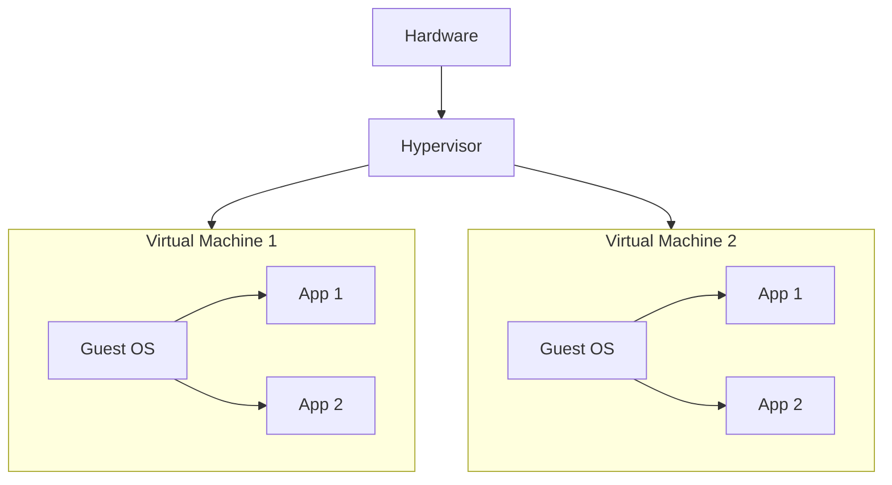

# Virtualization

- One computer can run multiple os.
- Instead of running multiple main services inside one computer we can run multiple os in one computer and run all our services on top of that.
- Virtualization partitions our physical resource into virtual resource.
- Server virtualization, Network Virtualization, Storage Virtualization

